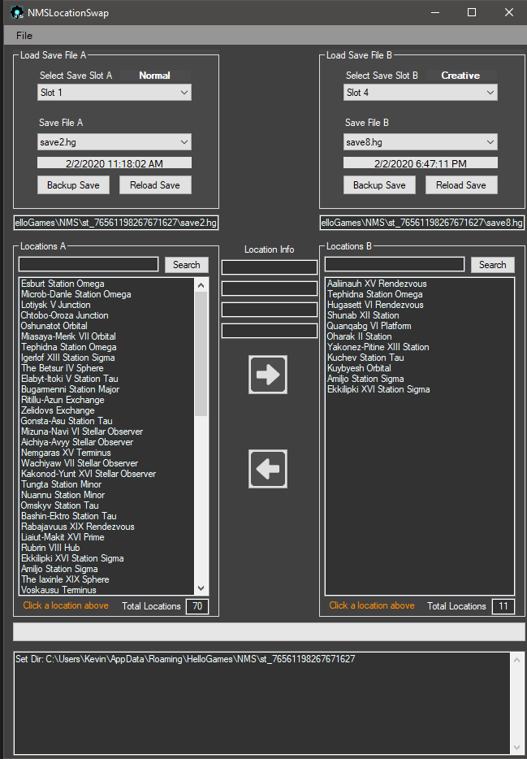

# NMSLocationSwap
 This is a location management tool for No Man's Sky
 
|               NMSLS                       |
|                :---:                      |
|              |

# NMSLocationSwap
Swap Space Station locations between Saves and delete unwanted locations from the Terminus/Teleport

## Download - UPDATE v1.0.1 (AUG 16 2020)

<!--* Download will be available later today. -->
<pre>  </pre>

## Getting Started

Here is an overview of what you need to get started with NMS

### Requirements

The current version of NMSLocationSwap requires No Man's Sky Beyond/Synthesis/Exo Mech/Crossplay/Desolation 2.2-2.62

:exclamation: **Always back up all your game data and saves before any mods**

### Installation and setup

	1. Backup all you save files at Location: C:\Users\[Name]\AppData\Roaming\HelloGames\NMS\st_xxxxxxxxx
	2. Download the latest release .zip file.
	3. Extract the .zip to your desired location.
	4. Create a shortcut to NMSLocationSwap.exe for your desktop.
	5. Run NMSLocationSwap.exe. 
	6. Select Save slot A and B, and have fun!

### Instructions

	1. Coming Soon!
  
## Change Log
* [Changelog](https://github.com/Kevin0M16/NMSLocationSwap/blob/master/CHANGELOG.md) - For viewing version history.

## Built With

* [Visual Studio 2019](https://visualstudio.microsoft.com/downloads/) - For the Windows 10 UI
* [Notepad++](https://notepad-plus-plus.org/) - For viewing Json
* [VSCode](https://code.visualstudio.com/) - For just about Everything

## Authors

* **Kevin Lozano** - *Initial work* - [Kevin0M16](https://github.com/Kevin0M16)

## License

This project is licensed under the MIT License - see the [LICENSE](/LICENSE.txt) file for details

## Acknowledgments

* [NMSCoordinates](https://kevin0m16.github.io/NMSCoordinates) - Another great NMS tool
